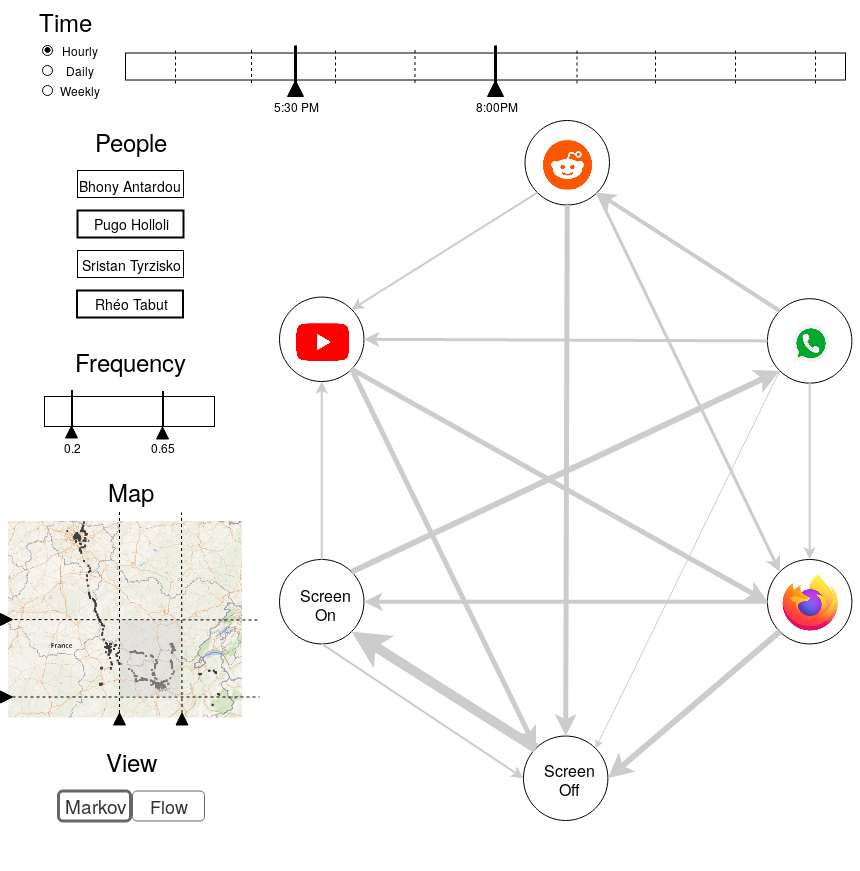

# VizThat

## Requirements
### Python
* `pymongo`
* `pythondns`

## Data format
Our data will be stored with JSON, and each block can have at least one of the following attributes:

* `Data_Id` : a unique id in order to quickly get a data block
* `User_Name` : the name of the user
* `Smartphone_Brand` : the brand of the smartphone
* `Smartphone_Model` : the model of the smartphone (must be used with `Smartphone_Brand`)
* `Date_Start` : start date of the measure
* `Date_End` : end date of the measure (must be used with `Date_Start`)
* `App_Usage_Duration` : duration for a specific app (must be used with `Date_Start` and `Application_Name`)
* `Phone_Usage_Duration` : usage duration of the phone for a specific interval (must be used with `Date_Start`)
* `Application_Name` : name of the application
* `Application_Checks` : number of checks for an application in a specific interval (must be used with `Date_Start`, `Date_End`)
* `Phone_Checks` : number of phone checks in a specific interval (must be used with `Date_Start`, `Date_End`)
* `Battery` : percentage of battery
* `Tags` : textual description items

## Visualizations
### App Graph

**Description** : The AppGraph visualization aims to represent habits in app navigation with a directed weighted graph. Nodes are apps and a link from node $A$ to node $B$ represents the switch between the app $A$ and the app $B$. The links are weighted according to how often the switch occurs in the data. For more precise information, we can consider printing the frequency in its absolute form or in its relative form (percentage or probability). 

**Utility** : This graph tries to represent the user's behaviour as he uses several applications. The thickness of the arrows can help identify user habits and, in a way, shows a probability distribution for each application. Therefore, with several hypothesis, this graph can be considered as a Markov Chain.

## Sources
Energy :  
    - smartphone users & smartphone penetration : https://www.bankmycell.com/blog/how-many-phones-are-in-the-world  
    - % of smartphones by brand by country : https://gs.statcounter.com/vendor-market-share/mobile/worldwide  
    - battery capacity of smartphones : https://www.androidauthority.com/smartphone-battery-capacity-887305/  
    
Economy :  
    - Electricity pricing by country : https://en.wikipedia.org/wiki/Electricity_pricing  
    - Voltage by country : https://www.worldstandards.eu/electricity/plug-voltage-by-country/  
    

